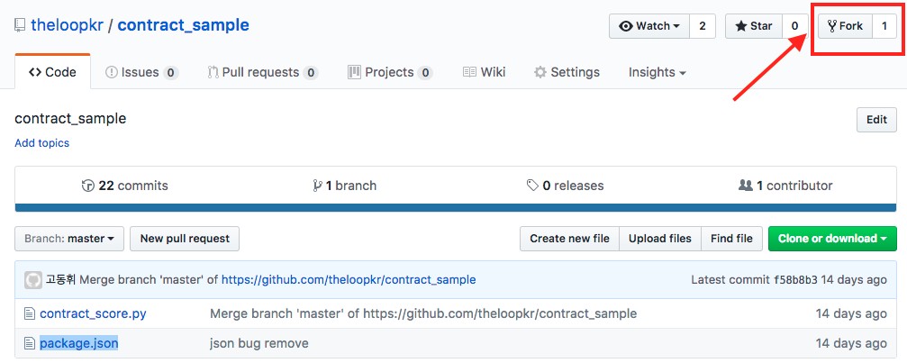
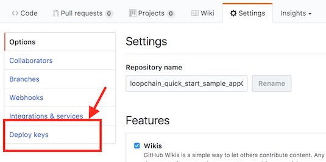
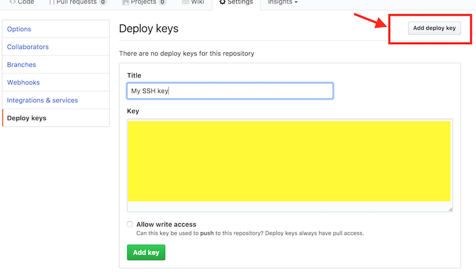

Tutorial:loopchain application 작성하기
==========================

## 소개 
 이 문서는 Loopchain을 docker로 띄워서 실제 SCORE를 작성해보는 과정을 다룹니다. *SCORE 예제 실행을 위해서는 반드시 [github](www.github.com)계정이 있어야 합니다.*


## 0. Docker 설치하기 

 Linux, macOS, Windwos에서 Docker를 설치해주세요. 아래의 명령을 Console에서 실행하면 현재 docker의 동작 여부를 확인 할 수 있습니다. Docker를 설치해야 하는 분은 [링크](https://www.docker.com/)를 참고 바랍니다. 
 
```buildoutcfg
$ docker --version
Docker version 17.06.0-ce, build 02c1d87
```

## 1. loopchain을 위한 docker image 받기 
 
 현재 [Docker Hub](https://hub.docker.com/search/?isAutomated=0&isOfficial=0&page=1&pullCount=0&q=loopchain&starCount=0)에서 loopchain의 docker image를 받으실 수 있습니다. 다음의 명령을 입력하십시오. 
 
```buildoutcfg
$ docker pull loopchain/loop-base
$ docker pull loopchain/looprs
$ docker pull loopchain/looppeer
$ docker pull loopchain/loopchain-fluentd
```

 이 명령이 이상없이 실행 된다면 아래와 같이 테스트 해보실 수 있습니다. 
```buildoutcfg
$ docker images
REPOSITORY                    TAG                 IMAGE ID            CREATED             SIZE
loopchain/looppeer            latest              bd2375208529        3 days ago          800MB
loopchain/looprs              latest              631f5a7b8198        3 days ago          800MB
loopchain/loop-base           latest              d799cb8d6fc3        3 days ago          578MB
loopchain/loopchain-fluentd   latest              24e5176dac78        3 days ago          36MB
```

## 2. 여러 Docker container를 실행해서 blockchain network 구성하기 

 [Docker compose 예제](https://github.com/theloopkr/loopchain_public_deploy)의 Repository를 아래의 명령으로 Clone 받고 해당 폴더로 이동합니다.
  
```buildoutcfg
$ git clone https://github.com/theloopkr/loopchain_public_deploy.git
$ cd loopchain_public_deploy
```

 이제 여러 Docker container를 실행해서 blockchain network 구성합니다. 다수의 docker container를 한번에 실행하기 위해서 [docker compose](https://docs.docker.com/compose/)라는 기술을 이용합니다. 
 
 아래와 같이 명령을 입력합니다. 
 
 ```
$ chmod 0600 ./score_key
$ docker network create loopchain
$ docker-compose up -d
$ docker ps -a
```
 정상적으로 동작하는지를 확인하기 위해 다음의 명령을 입력해봅니다. 
 
```
$ docker ps -a
CONTAINER ID        IMAGE                                COMMAND                  CREATED             STATUS              PORTS                                                                     NAMES
1609e948c797        loopchain/looppeer:latest            "python3 peer.py -..."   13 seconds ago      Up 10 seconds       0.0.0.0:7100->7100/tcp, 0.0.0.0:9000->9000/tcp, 7101-7102/tcp             peer0
f530fbd32a52        loopchain/looppeer:latest            "python3 peer.py -..."   13 seconds ago      Up 10 seconds       7100-7102/tcp, 0.0.0.0:7300->7300/tcp, 9000/tcp, 0.0.0.0:9200->9200/tcp   peer2
627492ae2b0a        loopchain/looppeer:latest            "python3 peer.py -..."   13 seconds ago      Up 11 seconds       7100-7102/tcp, 0.0.0.0:7200->7200/tcp, 9000/tcp, 0.0.0.0:9100->9100/tcp   peer1
227478a9f353        loopchain/looprs:latest              "python3 radiostat..."   14 seconds ago      Up 12 seconds       0.0.0.0:7102->7102/tcp, 7100-7101/tcp, 0.0.0.0:9002->9002/tcp             radio_station
27c32e8b5430        loopchain/loopchain-fluentd:latest   "/bin/entrypoint.s..."   16 seconds ago      Up 14 seconds       5140/tcp, 24284/tcp, 0.0.0.0:24224->24224/tcp                             fluentd-logger
```

아래와 같이 curl을 이용한 RESTful API를 통한 확인도 가능합니다. 

``` 
$ curl http://localhost:9002/api/v1/peer/list  # 현재 blockchain network를 구성하고 있는 peer들의 목록을 보여줍니다. 
$ curl http://localhost:9000/api/v1/status/peer # 현재 Peer0 의 상태를 보여줍니다. 
$ curl http://localhost:9100/api/v1/status/peer # 현재 Peer1 의 상태를 보여줍니다. 
$ curl http://localhost:9200/api/v1/status/peer # 현재 Peer2 의 상태를 보여줍니다. 
```

loopchain의 각 Peer들은 위의 예제와 같이 [RESTful API](proxy_rest_api.md)를 통해서 Peer들에 명령을 보내거나 상태를 확인 할 수 있습니다. Console에 익숙하지 않으신 분들을 위해 [POSTMan](https://www.getpostman.com/collections/bcea1a210a580fcb9eb3)을 준비했습니다. 

몇 가지 예제를 보여드리면 아래와 같습니다. 

* Tx 한 개를 만들어 봅니다. 

```
curl -H "Content-Type: application/json" -X POST -d '{}' http://localhost:9000/api/v1/transactions
{"response_code": "0", "tx_hash": "699b18468998a1dc38d7974d77e36e975aac3ea28e8a3e88c01415d848193ca7", "more_info": ""}

```

* Transaction의 상태 정보를 요청합니다. 

```
curl http://localhost:9000/api/v1/transactions/result?hash={hash of transaction was created before}
{"response_code": "0", "response": {"code": 9000, "message": "'method'", "jsonrpc": "2.0"}}

```


## 3. localchain network 정지 

 다음 작업을 위해 아래 명령으로 Local network를 정지시키겠습니다.
  
 ```buildoutcfg
 $ docker-compose down
 ```


## 4. SCORE 사용해보기 
 SCORE는 loopchain에서 이용하는 Smart contract 입니다. 가장 기본적인 SCORE의 형태는 [loopchain_quick_start_sample_app01]( https://github.com/theloopkr/loopchain_quick_start_sample_app01)를 참고하십시오. [SCORE 문서](score/README.md)를 참고하시면 더 세부적인 정보를 확인 할 수 있습니다.
  
  이번 예제에서는 제안을 하면 수락하고, 그 과정을 기록하는 계약서를 실행해 보겠습니다. 아래의 순서로 하면 됩니다. 
  
### 4.1 예제 SCORE를 내 소유의 저장소로 Fork하기 
  1. 먼저 [Github](https://github.com/)에 계정을 만드십시오. 
  2. [contract_sample](https://github.com/theloopkr/contract_sample)으로 들어가서 *Fork*를 하십시오. 
  
  
  
  
### 4.2 Local 컴퓨터의 SSH key를 Github에 등록합니다 

  외부에서 여러분의 컴퓨터에서 Github로 접속하려면 여러분 컴퓨터의 SSH키를 github.com에 알려줘야 합니다. 
  
#### macOS, Linux
  
  아래의 명령으로 현재 여러분 컴퓨터의 개인 공유key를 읽어봅니다.
  ```
  $ cat ~/.ssh/id_rsa.pub
  $ chmod 0600 ~/.ssh/id_rsa.pub # docker image 안에 있는 loopchain peer가 github에 접근할 수 있게 권한을 바꿔줍니다. 
  ``` 
 
#### Windows
  ```
   To-Do: 곧 지원합니다.
  ```

  1. 여러분이 위에서 Fork한 repository로 갑니다 
  2. [Settings]을 누릅니다 
  
  
  
  3. [Deploy keys]를 누릅니다 
  
  
  
  4. 여러분 컴퓨터의 SSH key를 입력합니다. 
  
  
  
  
## 5. docker compose의 환경변수를 변경합니다.

1. 앞서 받은 loopchain_public_deploy 폴더로 갑니다.
2. ```.env```파일은 아래와 같이 변경합니다. 
```
DEFAULT_SCORE_HOST=github.com
DEPLOY_SCORE={your_id}/contract_sample
SSH_AUTH_SOCK=/root/.ssh/id_rsa
```
3. ```docker-compose.yml```아래 ```volumes```에서 지정한 key의 path를 여러분의 개인 공유키 (예를 들어 ``` ~/.ssh/id_rsa.pub``` )로 바꿔주십시오.

```
  peer[n]:
    container_name: peer[n]
    image: ...
    env_file: ...
    depends_on: ...
    links: ...
    ...
    volumes:
      - {여러분의 개인 공유키의 절대경로를 넣어주세요.}:/root/.ssh/id_rsa
      or
      - {여러분의 개인 공유키의 상대경로를 넣어주세요.}:/root/.ssh/id_rsa:ro
    ...

```


## 6. Server 올리기 
 이제 여러분이 만든 Blockchain network를 다시 실행해보겠습니다. 
```
  $ docker-compose up -d
```
  

## 7. 상태 확인하기 

 이제 서버가 정상적으로 올라왔는지 각 Peer들을 확인해봅니다. 이 때, 각 Peer들의 ```block_height```와 ```total_tx```의 값들을 메모해 두십시오. 


```
$ curl http://localhost:9000/api/v1/status/peer
{"made_block_count": 0, "status": "Service is online: 1", "audience_count": 2, "consensus": "siever", "peer_id": "1e86e596-73b4-11e7-a1dc-0242ac120004", "peer_type": "1", "block_height": 0, "total_tx": 0, "peer_target": "172.18.0.4:7100"}

$ curl http://localhost:9100/api/v1/status/peer
{"made_block_count": 0, "status": "Service is online: 0", "audience_count": 0, "consensus": "siever", "peer_id": "1ee72500-73b4-11e7-b986-0242ac120005", "peer_type": "0", "block_height": 0, "total_tx": 0, "peer_target": "172.18.0.5:7200"}

$ curl http://localhost:9200/api/v1/status/peer
{"made_block_count": 0, "status": "Service is online: 0", "audience_count": 0, "consensus": "siever", "peer_id": "1f014610-73b4-11e7-a2f7-0242ac120006", "peer_type": "0", "block_height": 0, "total_tx": 0, "peer_target": "172.18.0.6:7300"}

``` 
 
## 8. 현재 올라온 SCORE의 버전 확인하기 

현재 올라온 SCORE의 버전을 확인해보겠습니다. ``` GET api/v1/status/score```를 통해 확인 할 수 있습니다. Response에 나오는 ```version```은 최종 git hash입니다. ```all_version```은 해당 SCORE가 바뀌어온 git hash 정보입니다.

```
$ curl http://localhost:9000/api/v1/status/score

{
    "id": "{여러분의 github 계정}/contract_sample",
    "version": "f58b8b3e955984a09674a1f74c493001678d706c",
    "all_version": [
        "f58b8b3e955984a09674a1f74c493001678d706c",
        "b39064b358b84798f20f024fca066a113ec88b18",
        "99923ce139350cf8f37ef9f72fddf3f327da4d7a",
        ........
    ],
    "status": 0
}

```


## 9. SCORE에 Transaction 보내기

 이제 SCORE를 실행해보겠습니다. 이 예제에서는 ```propose()```라는 내부 함수를 불러서 계약 내용을 보내는 Transaction을 Peer0에 만들어보겠습니다. 이 ```propose()```는 ``` params ```아래에 있는 JSON data를 받아서 내부에서 처리하게 됩니다. 

```

$ curl -H "Content-Type: application/json" -X POST -d '{"jsonrpc":"2.0","method":"propose","params":{"proposer":"RealEstateAgent" , "counterparties": ["leaseholder","lessor"], "content": "A아파트 203동 803호를 보증금 1500 월세 70에 계약 2019년 8월 1일까지 임대함, 임대 취소시 ~~~ ", "quorum": "3"}}' http://localhost:9000/api/v1/transactions


{
 "response_code": "0", 
 "tx_hash": "2ef0338a4d597661c936cc43df18a53a35d96fa5a1247071717f200c401d3561",  # 위의 SCORE로 만들어진 Transaction의 Hash
 "more_info": ""
}

```


## 10.Transaction 확인하기 

이제 위의 Transaction 이 정상적으로 실행이 되었는지 확인해보겠습니다. ```/api/v1/transaction/result?hash={Score결과로 얻은 transaction의 hash}```를 아래와 같이 실행해봅니다. 

```
$ curl http://localhost:9000/api/v1/transactions/result?hash=2ef0338a4d597661c936cc43df18a53a35d96fa5a1247071717f200c401d3561


{
    "response_code": "0",
    "result": {
        "code": 0
    }
}
```


## 11.전체 Transaction이 모든 Peer에 전파되었는지 확인. 

```
curl http://localhost:9000/api/v1/status/peer
curl http://localhost:9100/api/v1/status/peer
curl http://localhost:9200/api/v1/status/peer
```
이 때, 각 Peer들의 결과에서 ```block_height```와 ```total_tx```의 값들이 모두 같으면 성공한 것입니다. 


##  요약
이번 Tutorial에서는 아래와 같은 것들을 해보았습니다. 
1. Docker compose를 이용해서 Docker image로 배포되는 loopchain으로 blockchain network를 구성해보았습니다. 
2. Github에 올라가 있는 SCORE 예제를 가져와서 Local에 구성한 blockchain에 올려보았습니다.
3. SCORE를 실행해서 결과를 확인합니다. 

